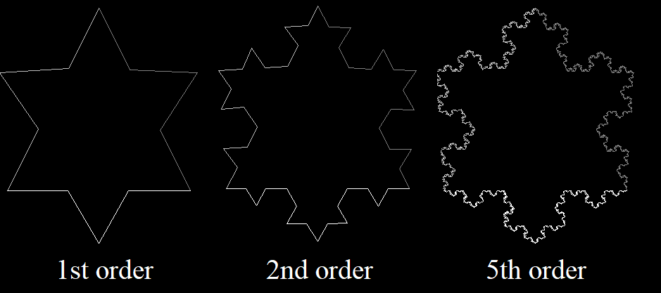
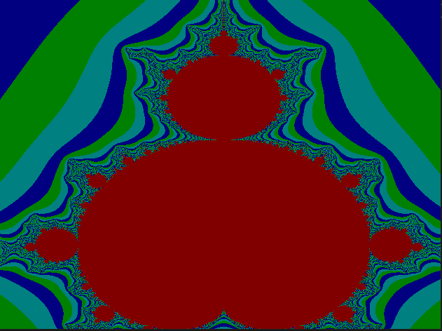

# Fractals (2022). University Computer Graphics Assignment.
# Requires [Graphics](https://github.com/ahuynh359/Graphics)
Supports: Win x86.

## Implemented:
### Koch Curve
### 
### Mandelbrot Set (order = 1000)
### 
### Barnsley Fern (order = 100000)
### 

